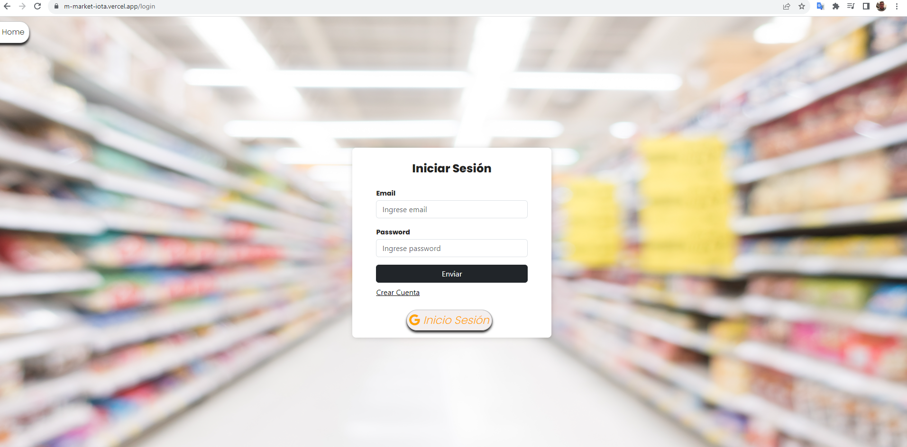
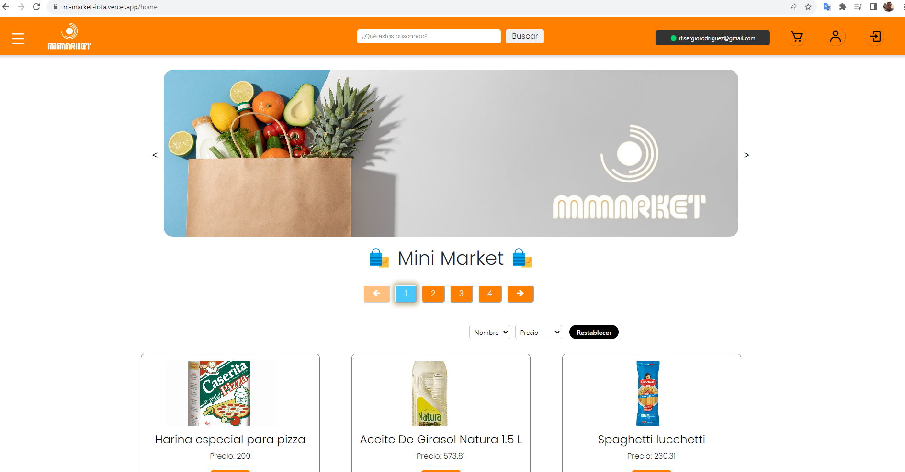
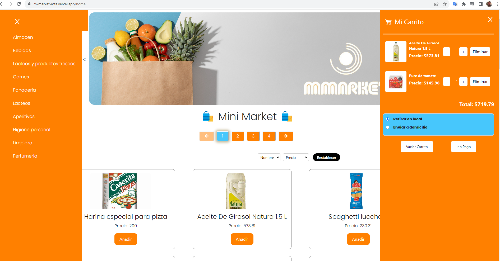
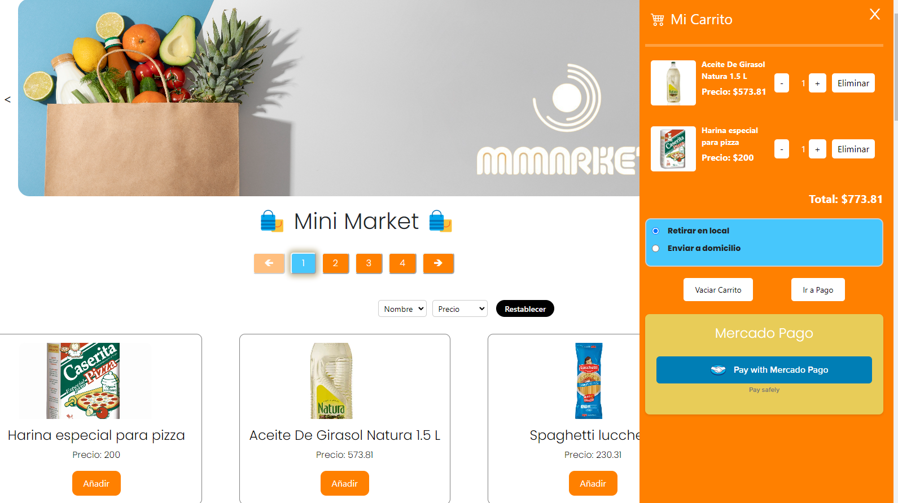
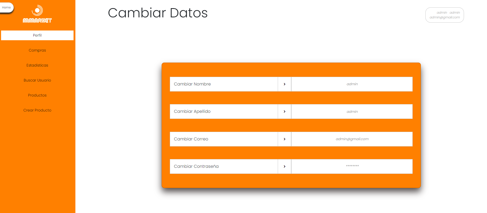
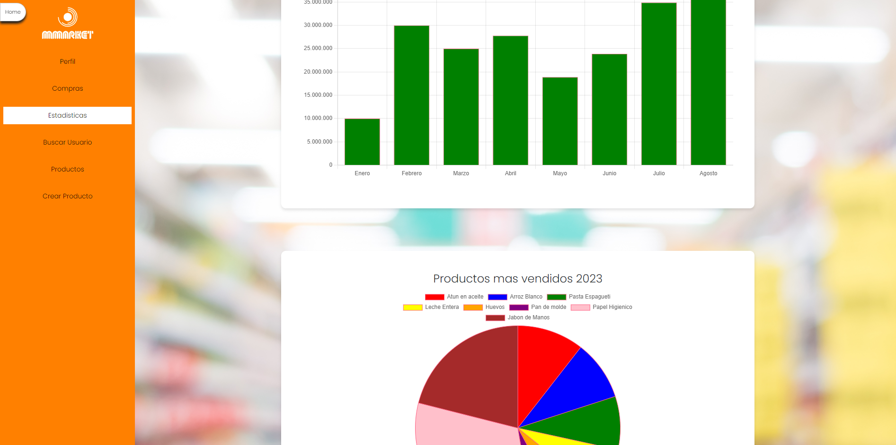

    

# Proyecto Final - M-Market

Plataforma web para realizar compras de  tipo Minimercado.
##### Link: [M-Market](https://m-market-iota.vercel.app/home "M-Market")

## Descripción

Esta plataforma le permite a la persona que sea dueña de un Almacen de diferentes rubros tipo minimercado, poder extender su alcance de ventas a traves de internet, con opciones de retiro por local, como tambien la opcion de envios a domicilio. El cliente puede realizar sus pagos a traves de MercadoPago. Este es un sistema pensado tanto para que el dueño del negocio pueda obtener un mayor crecimiento en sus ventas, como  tambien para el cliente del mismo que le va permitir tener una mejor experiencia al elegir sus productos, comprarlos y recibirlos en su propia casa.

## Características Clave

- **Expansión en línea:** Permite a los comerciantes de barrio establecer una presencia en línea para llegar a un público más amplio.
- **Envíos o Delivery:** Facilita la entrega de productos a los clientes, brindando comodidad y eficiencia.
- **Pagos con Mercado Pago:** Proporciona una forma segura y conveniente para que los clientes realicen pagos en línea.
- **Gestión de Pedidos:** Permite a los comerciantes administrar y rastrear los pedidos de manera efectiva.
- **Personalización:** Permite a cada comerciante personalizar su tienda en línea de acuerdo con su marca.

## Login 
Aqui tenemos la posibilidad de realizar el login usando cuenta propia de Gmail, o tambien posibilidad de crear cuenta propia.

## Home
Aqui se muestran los productos con sus respectivos precios, con opcion de realizar la eleccion de los mismos, como tambien asi el  ordenamiento, busquedas por nombre, por rubros y varias opciones intuitivas para la experiencia del usuario.

## Carrito de Compras

Aqui se pueden anexar productos elegidos y sus respectivas cantidades .

## Pasarela de Pago

Se utiliza pasarela de pago (Mercado Pago), para que el usuario pueda realizar efectivamente su compra.

## Dashboard

En esta seccion tenemos la opcion de Admin, para ver ventas por clientes, ventas del dia, etc. Tambien la posibilidad de crear nuevos usuarios con permisos de administrador, de crear o modificar los productos y tambien manejar stock de los mismos.
Existe en esta seccion tambien la posibilidad de ver graficas de estadisticas, etc.

## Tecnologias 

* React

* React-Redux

* Redux

* Material UI

* PostgreSQL

* Sequelize

* NodeJS

* Express

* Cloudinary 

* Auth0

